# Azure Static Web Apps Pipeline - Clean Execution Flow

## 🎯 **Complete Pipeline Execution Flow**

```mermaid
flowchart TD
    Start([🚀 GitHub Event]) --> EventCheck{Event Type?}
    
    EventCheck -->|Manual| Manual[👤 workflow_dispatch]
    EventCheck -->|Push| Push[📤 push to main]
    EventCheck -->|PR Open/Update| PR[🔄 pull_request]
    EventCheck -->|PR Closed| Close[❌ PR Closed]
    
    Manual --> MainJob[🏗️ Main Job Start]
    Push --> MainJob
    PR --> MainJob
    Close --> CloseJob[🧹 Close PR Job]
    
    CloseJob --> Cleanup[📋 Cleanup Preview Environment]
    Cleanup --> End1[✅ PR Cleanup Complete]
    
    MainJob --> Checkout[📂 Checkout Code]
    Checkout --> AZDSetup[🔧 Setup Azure Developer CLI]
    AZDSetup --> Config[📋 Read & Validate Configuration]
    
    Config --> ConfigExists{config/environments.json exists?}
    ConfigExists -->|❌ No| ConfigError[💥 Exit: Config file not found]
    ConfigExists -->|✅ Yes| ExtractConfig[📝 Extract Configuration Values]
    
    ExtractConfig --> ValidateRequired{Required config valid?}
    ValidateRequired -->|❌ No| RequiredError[💥 Exit: Missing resource group or app name]
    ValidateRequired -->|✅ Yes| CheckOIDC{OIDC config available?}
    
    CheckOIDC -->|✅ Yes: clientId, tenantId, subscriptionId| OIDCAuth[🔐 Azure Login - OIDC]
    CheckOIDC -->|❌ No: Missing values| InteractiveAuth[👤 Azure Login - Interactive]
    
    OIDCAuth --> CLISetup[⚙️ Azure CLI Setup]
    InteractiveAuth --> CLISetup
    
    CLISetup --> ResourceCheck[🔍 Check Existing Resources]
    ResourceCheck --> RGExists{Resource Group exists?}
    
    RGExists -->|❌ No| FullDeploy[🏗️ Full Provisioning Required]
    RGExists -->|✅ Yes| SWAExists{Static Web App exists?}
    
    SWAExists -->|❌ No| FullDeploy
    SWAExists -->|✅ Yes| ConfigDrift{Configuration drift detected?}
    
    ConfigDrift -->|⚠️ Yes: Location changed| UpdateDeploy[🔄 Update Required]
    ConfigDrift -->|✅ No: Matches config| SkipInfra[⏭️ Skip Infrastructure]
    
    FullDeploy --> CreateRG[🏗️ Create Resource Group]
    UpdateDeploy --> CreateRG
    CreateRG --> RGCreated{RG creation successful?}
    
    RGCreated -->|❌ No| RGError[💥 Exit: RG creation failed]
    RGCreated -->|✅ Yes| DeployBicep[🚀 Deploy Bicep Template]
    
    DeployBicep --> BicepSuccess{Bicep deployment successful?}
    BicepSuccess -->|❌ No| BicepError[💥 Exit: Bicep deployment failed]
    BicepSuccess -->|✅ Yes| GetNewToken[🔑 Get API Token - New Infrastructure]
    
    SkipInfra --> SkipLog[📋 Log: Skipping deployment - no changes]
    SkipLog --> GetExistingToken[🔑 Get API Token - Existing Infrastructure]
    
    GetNewToken --> TokenValid1{API token retrieved?}
    GetExistingToken --> TokenValid2{API token retrieved?}
    
    TokenValid1 -->|❌ No| TokenError1[⚠️ Manual deployment required]
    TokenValid1 -->|✅ Yes| ContentDetection[🔍 Detect Content Changes]
    TokenValid2 -->|❌ No| TokenError2[⚠️ Could not retrieve token]
    TokenValid2 -->|✅ Yes| ContentDetection
    
    ContentDetection --> GitDiff[📂 Git Diff Analysis]
    GitDiff --> FilesChanged{Files changed?}
    
    FilesChanged -->|❌ No changes| DefaultContent[📱 Manual trigger - Deploy content]
    FilesChanged -->|✅ Changes found| AnalyzeChanges[📝 Analyze Change Types]
    
    AnalyzeChanges --> ContentChanged{src/ or config/ changed?}
    ContentChanged -->|❌ No: Only infra/workflow| SkipContent[⏭️ Skip Content Deployment]
    ContentChanged -->|✅ Yes| DeployContent[📦 Deploy Content]
    DefaultContent --> DeployContent
    
    DeployContent --> InfraSource{Infrastructure source?}
    InfraSource -->|🆕 New/Updated| NewInfraDeploy[📤 Deploy to New Infrastructure]
    InfraSource -->|📦 Existing| ExistingInfraDeploy[📤 Deploy to Existing Infrastructure]
    
    NewInfraDeploy --> ContentSuccess1{Content deployment successful?}
    ExistingInfraDeploy --> ContentSuccess2{Content deployment successful?}
    
    ContentSuccess1 -->|❌ No| ContentError1[💥 Content deployment failed]
    ContentSuccess1 -->|✅ Yes| DomainCheck[🌐 Check Custom Domain Config]
    ContentSuccess2 -->|❌ No| ContentError2[💥 Content deployment failed]
    ContentSuccess2 -->|✅ Yes| DomainCheck
    SkipContent --> SkipContentLog[📋 Log: No content changes]
    SkipContentLog --> DomainCheck
    
    DomainCheck --> DomainEnabled{Custom domain enabled?}
    DomainEnabled -->|❌ No| SkipDomain[⏭️ Skip Domain Configuration]
    DomainEnabled -->|✅ Yes| SWAReady{Static Web App exists?}
    
    SWAReady -->|❌ No| DomainLater[ℹ️ Domain config after deployment]
    SWAReady -->|✅ Yes| DomainExists{Domain already configured?}
    
    DomainExists -->|✅ Yes| DomainExistsLog[✅ Domain already exists]
    DomainExists -->|❌ No| DomainType{Domain type?}
    
    DomainType -->|subdomain.domain.com| CNAMESetup[📝 Configure CNAME Validation]
    DomainType -->|domain.com| TXTSetup[📝 Configure DNS TXT + A Validation]
    
    CNAMESetup --> DomainConfigSuccess1{Domain config successful?}
    TXTSetup --> DomainConfigSuccess2{Domain config successful?}
    
    DomainConfigSuccess1 -->|❌ No| DomainError1[⚠️ Manual domain config required]
    DomainConfigSuccess1 -->|✅ Yes| GetDNSDetails[📋 Get DNS Configuration Details]
    DomainConfigSuccess2 -->|❌ No| DomainError2[⚠️ Manual domain config required]
    DomainConfigSuccess2 -->|✅ Yes| GetDNSDetails
    
    GetDNSDetails --> GenerateDNS[📝 Generate DNS Instructions]
    GenerateDNS --> FinalOutput[📊 Output Deployment Information]
    
    SkipDomain --> SkipDomainLog[📋 Log: Domain disabled]
    DomainLater --> DomainLaterLog[📋 Log: Domain config later]
    DomainExistsLog --> FinalOutput
    SkipDomainLog --> FinalOutput
    DomainLaterLog --> FinalOutput
    DomainError1 --> FinalOutput
    DomainError2 --> FinalOutput
    TokenError1 --> FinalOutput
    TokenError2 --> FinalOutput
    
    FinalOutput --> DeploymentType{Deployment type?}
    DeploymentType -->|⏭️ Content Only| ContentSummary[📋 Content-Only Summary]
    DeploymentType -->|🏗️ Full Infrastructure| InfraSummary[📋 Full Infrastructure Summary]
    
    ContentSummary --> ShowURLs[🌐 Show Access URLs]
    InfraSummary --> ShowURLs
    
    ShowURLs --> CustomDomainOutput{Custom domain enabled?}
    CustomDomainOutput -->|❌ No| DefaultURL[🔗 Show Default Azure URL]
    CustomDomainOutput -->|✅ Yes| CustomURL[📋 Show Custom Domain + DNS Instructions]
    
    DefaultURL --> Success[🎉 Pipeline Success]
    CustomURL --> Success
    
    %% Error paths
    ConfigError --> ErrorEnd[💥 Pipeline Failed]
    RequiredError --> ErrorEnd
    RGError --> ErrorEnd
    BicepError --> ErrorEnd
    ContentError1 --> ErrorEnd
    ContentError2 --> ErrorEnd
    
    %% Styling
    style Start fill:#e1f5fe
    style Success fill:#e8f5e8
    style ErrorEnd fill:#ffebee
    style End1 fill:#e8f5e8
    style ConfigError fill:#ffebee
    style RequiredError fill:#ffebee
    style RGError fill:#ffebee
    style BicepError fill:#ffebee
    style ContentError1 fill:#ffebee
    style ContentError2 fill:#ffebee
    style FullDeploy fill:#fff3e0
    style UpdateDeploy fill:#fff8e1
    style SkipInfra fill:#e8f5e8
    style SkipContent fill:#e8f5e8
    style SkipDomain fill:#e8f5e8
```



## 🔍 **Key Decision Points & Validations**

### **1. Configuration Validation**
- ✅ **File Exists**: `config/environments.json` must exist
- ✅ **Required Fields**: Resource group and Static Web App name must be configured
- ✅ **OIDC Check**: ClientId, TenantId, SubscriptionId availability
- ✅ **Domain Validation**: If required, domain format and configuration check

### **2. Authentication Decision**
- **OIDC Available** → Federated identity login
- **OIDC Missing** → Interactive Azure CLI login with device code

### **3. Infrastructure Decision Matrix**
- **Resource Group Missing** → Full provisioning required
- **Static Web App Missing** → Full provisioning required  
- **Configuration Drift** → Update deployment needed
- **Everything Exists & Matches** → Skip infrastructure

### **4. Content Deployment Logic**
- **No Changes** → Manual trigger, deploy content anyway
- **src/ or config/ Changed** → Deploy content
- **Only infra/ or workflow/ Changed** → Skip content deployment

### **5. Custom Domain Configuration**
- **Domain Disabled** → Skip entirely
- **Static Web App Missing** → Configure after deployment
- **Domain Already Exists** → Skip configuration
- **Subdomain** → CNAME validation setup
- **Apex Domain** → DNS TXT + A record validation setup

## ⚡ **Execution Paths**

### **🚀 First Deployment** (New Project)
```
Trigger → Config OK → OIDC Auth → No Resources → Full Deploy → Content Deploy → Domain Setup → Success
Timeline: ~8-12 minutes
```

### **📦 Content Update** (Existing Infrastructure)
```
Trigger → Config OK → OIDC Auth → Resources Exist → Skip Infra → Content Changed → Deploy Content → Skip Domain → Success  
Timeline: ~2-4 minutes
```

### **⏭️ No Changes** (Workflow/Infrastructure only)
```
Trigger → Config OK → OIDC Auth → Resources Exist → Skip Infra → No Content Changes → Skip Content → Skip Domain → Success
Timeline: ~1-2 minutes
```

### **💥 Error Scenarios**
- **Config Missing** → Exit at configuration validation
- **Required Fields Missing** → Exit at required validation  
- **Resource Group Creation Failed** → Exit at infrastructure deployment
- **Bicep Deployment Failed** → Exit at template deployment
- **Content Deployment Failed** → Exit at content upload

## 📊 **Performance Optimizations**

### **Smart Skipping Logic**
- ✅ **Infrastructure**: Skip if RG + SWA exist and no drift
- ✅ **Content**: Skip if no src/ or config/ changes  
- ✅ **Domain**: Skip if disabled or already configured

### **Parallel Operations**  
- ✅ **Configuration Validation**: Parse all values simultaneously
- ✅ **Resource Checks**: Multiple Azure CLI calls can run concurrently
- ✅ **Token Retrieval**: Efficient API key management

### **Conditional Execution**
- ✅ **18 conditional steps** with `if` statements
- ✅ **7 major decision trees** for different scenarios
- ✅ **Smart resource detection** prevents unnecessary deployments

This clean flowchart shows exactly how your 500+ line enterprise pipeline executes with all validation logic and decision points! 🎯
