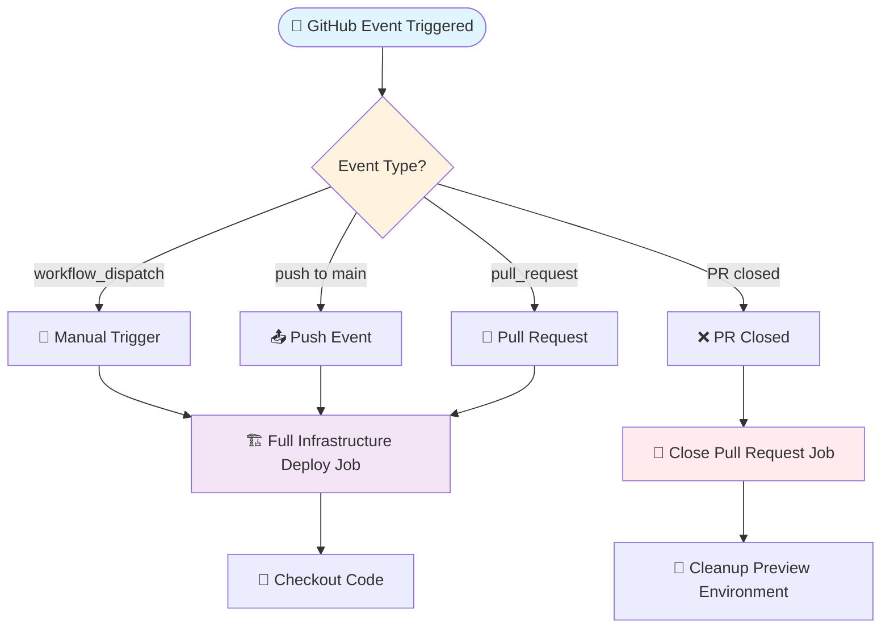
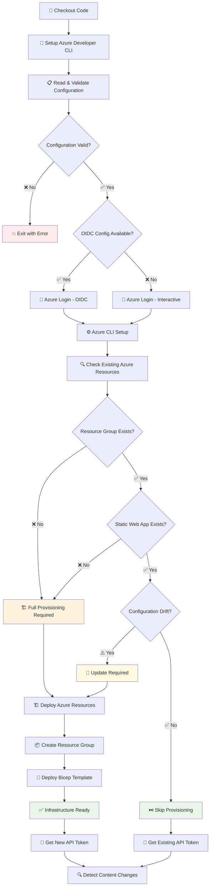
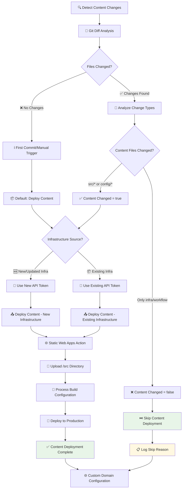
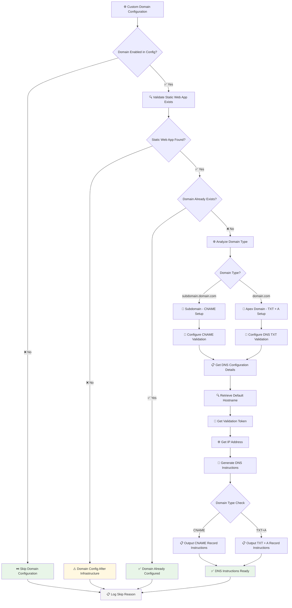
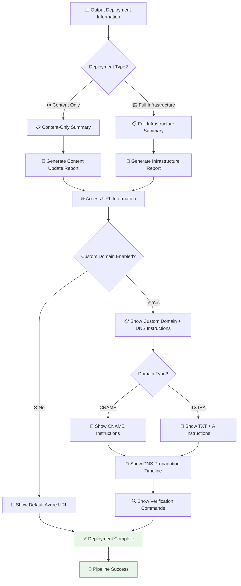
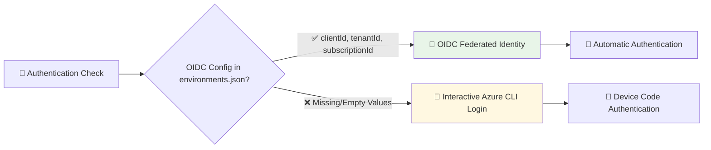
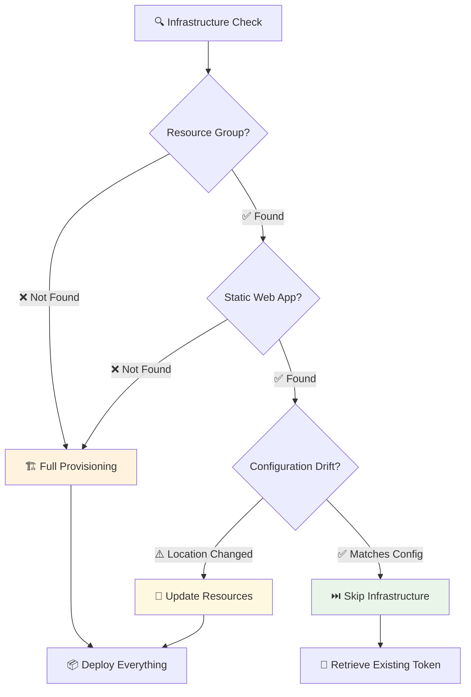
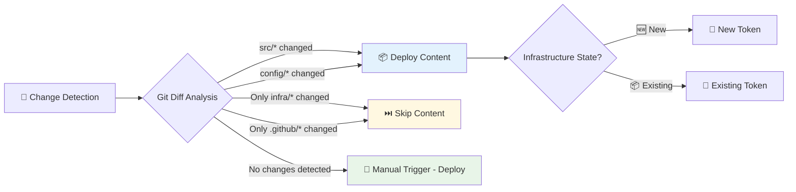
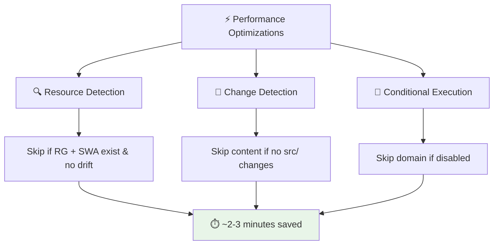
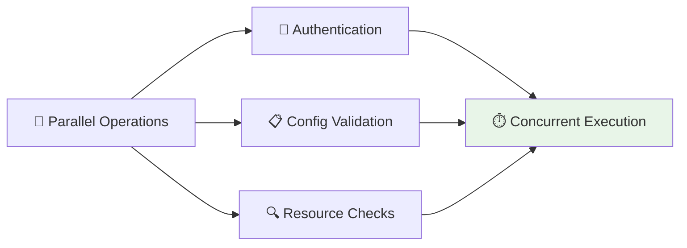

# Complete Execution Flow Diagram: Azure Static Web Apps CI/CD Pipeline

## 🎯 **Pipeline Overview**



## 🔄 **Main Execution Pipeline**



## 📦 **Content Deployment Flow**



## 🌐 **Custom Domain Configuration Flow**



## 📊 **Final Output & Summary Flow**



## 🔀 **Decision Matrix & Conditional Logic**

### **Authentication Decision Tree**


### **Infrastructure Decision Matrix**


### **Content Deployment Decision Logic**


## ⚡ **Performance & Optimization Points**

### **Smart Skipping Logic**


### **Parallel Processing**


## 🎯 **Complete Execution Timeline**

| Phase | Duration | Key Operations | Decision Points |
|-------|----------|----------------|-----------------|
| **🚀 Trigger & Setup** | 30-60s | Checkout, AZD setup, config validation | Event type, OIDC availability |
| **🔐 Authentication** | 15-30s | OIDC or interactive login | Config completeness |
| **🔍 Resource Discovery** | 15-45s | Check RG, SWA, configuration drift | Resource existence, drift detection |
| **🏗️ Infrastructure** | 0-300s | Create RG, deploy Bicep template | Skip if exists, deploy if missing |
| **📦 Content Deployment** | 30-120s | Static Web Apps action, file upload | Change detection, token retrieval |
| **🌐 Domain Configuration** | 30-60s | DNS setup, validation instructions | Domain enabled, type detection |
| **📊 Output & Summary** | 10-20s | Generate reports, URLs, instructions | Deployment type, domain status |

## 🎉 **Success Scenarios**

### **Scenario 1: First Deployment**
```
🚀 Manual Trigger → 🔐 OIDC Auth → 🏗️ Create Everything → 📦 Deploy Content → 🌐 Setup Domain → ✅ Success
Timeline: ~8-12 minutes
```

### **Scenario 2: Content Update**
```
📤 Push Event → 🔐 OIDC Auth → ⏭️ Skip Infrastructure → 📦 Deploy Content → ⏭️ Skip Domain → ✅ Success
Timeline: ~2-4 minutes
```

### **Scenario 3: No Changes**
```
📤 Push Event → 🔐 OIDC Auth → ⏭️ Skip Infrastructure → ⏭️ Skip Content → ⏭️ Skip Domain → ✅ Success
Timeline: ~1-2 minutes
```

This comprehensive flow shows exactly how your 500+ line enterprise-grade pipeline executes from trigger to completion! 🎯
