# Azure Static Web Apps Deployment Flowchart

## Complete CI/CD Pipeline Flow

```mermaid
flowchart TD
    A[Trigger Event] --> B{Event Type?}
    
    B -->|Manual| C[workflow_dispatch]
    B -->|Push to main| D[push event]
    B -->|PR opened/updated| E[pull_request event]
    B -->|PR closed| F[close_pull_request_job]
    
    C --> G[Full Infrastructure Deploy Job]
    D --> G
    E --> G
    
    F --> F1[Close Pull Request Action]
    F1 --> F2[Cleanup Preview Environment]
    
    G --> H[Checkout Code]
    H --> I[Setup Azure Developer CLI]
    I --> J[Read & Validate Configuration]
    
    J --> K{Configuration Valid?}
    K -->|No| K1[❌ Exit with Error]
    K -->|Yes| L{OIDC Config Available?}
    
    L -->|Yes| M[Azure Login - OIDC]
    L -->|No| N[Azure Login - Interactive]
    
    M --> O[Azure CLI Setup]
    N --> O
    
    O --> P[Check Existing Azure Resources]
    P --> Q{Resource Group Exists?}
    
    Q -->|No| R[❌ Full Provisioning Required]
    Q -->|Yes| S{Static Web App Exists?}
    
    S -->|No| R
    S -->|Yes| T[✅ Resources Found]
    
    T --> U{Configuration Drift?}
    U -->|Yes| V[⚠️ Update Required]
    U -->|No| W[✅ Skip Provisioning]
    
    R --> X[Deploy Azure Resources]
    V --> X
    
    X --> X1[Create/Validate Resource Group]
    X1 --> X2[Deploy Bicep Template]
    X2 --> X3[Provision Static Web App]
    X3 --> Y[Get API Token - New]
    
    W --> Z[Get API Token - Existing]
    
    Y --> AA[Detect Content Changes]
    Z --> AA
    
    AA --> BB{Content Changed?}
    BB -->|No| CC[⏭️ Skip Content Deployment]
    BB -->|Yes| DD{Infrastructure Source?}
    
    DD -->|New/Updated| EE[Deploy Content - New Infrastructure]
    DD -->|Existing| FF[Deploy Content - Existing Infrastructure]
    
    EE --> GG[Static Web Apps Action - Upload]
    FF --> GG
    
    GG --> HH{Custom Domain Enabled?}
    HH -->|No| II[⏭️ Skip Domain Config]
    HH -->|Yes| JJ[Configure Custom Domain]
    
    JJ --> KK{Domain Type?}
    KK -->|Subdomain| LL[CNAME Validation]
    KK -->|Apex| MM[DNS TXT + A Record]
    
    LL --> NN[Get DNS Configuration]
    MM --> NN
    II --> NN
    CC --> NN
    
    NN --> OO[Output Deployment Information]
    OO --> PP[🎉 Deployment Complete]
    
    style A fill:#e1f5fe
    style K1 fill:#ffebee
    style R fill:#fff3e0
    style V fill:#fff8e1
    style W fill:#e8f5e8
    style PP fill:#e8f5e8
    style X fill:#f3e5f5
    style GG fill:#e3f2fd
```



## Infrastructure Execution Flow

```mermaid
flowchart TD
    A[Infrastructure Check] --> B{Resource Group Exists?}
    
    B -->|No| C[Create Resource Group]
    B -->|Yes| D[Validate Existing Resources]
    
    C --> E[Set Location & Tags]
    E --> F[Deploy Bicep Template]
    
    D --> G{Static Web App Exists?}
    G -->|No| F
    G -->|Yes| H{Configuration Drift?}
    
    H -->|Yes| I[Update Resources]
    H -->|No| J[✅ Skip Infrastructure]
    
    F --> K[main.bicep Execution]
    I --> K
    
    K --> L[Parse Parameters]
    L --> M[Set Resource Names]
    M --> N[Apply Naming Convention]
    N --> O[Create Static Web App]
    
    O --> P[Configure App Settings]
    P --> Q[Set Repository Token]
    Q --> R[Enable HTTPS]
    R --> S[Configure Build Settings]
    
    S --> T[Output Resource Details]
    T --> U[Return API Token]
    U --> V[✅ Infrastructure Ready]
    
    J --> V
    
    style C fill:#fff3e0
    style F fill:#f3e5f5
    style I fill:#fff8e1
    style J fill:#e8f5e8
    style V fill:#e8f5e8
```



## Content Execution Flow

```mermaid
flowchart TD
    A[Content Deployment Start] --> B{Infrastructure Source?}
    
    B -->|New Deployment| C[Get API Token from Bicep Output]
    B -->|Existing Resources| D[Retrieve API Token from Azure]
    
    C --> E[Validate Token]
    D --> E
    
    E --> F{Token Valid?}
    F -->|No| G[❌ Deployment Failed]
    F -->|Yes| H[Content Change Detection]
    
    H --> I[Git Diff Analysis]
    I --> J{Content Files Changed?}
    
    J -->|No| K[⏭️ Skip Content Update]
    J -->|Yes| L[Prepare Content Package]
    
    L --> M[Static Web Apps Action]
    M --> N[Upload Source Files]
    N --> O[Process Build Configuration]
    
    O --> P{Build Required?}
    P -->|No| Q[Direct File Copy]
    P -->|Yes| R[Execute Build Pipeline]
    
    Q --> S[Deploy to Staging Slot]
    R --> S
    
    S --> T[Health Check]
    T --> U{Health Check Pass?}
    
    U -->|No| V[❌ Rollback Deployment]
    U -->|Yes| W[Swap to Production]
    
    W --> X[Cache Invalidation]
    X --> Y[CDN Refresh]
    Y --> Z[✅ Content Live]
    
    K --> Z
    V --> AA[❌ Deployment Failed]
    
    style G fill:#ffebee
    style K fill:#e8f5e8
    style M fill:#e3f2fd
    style S fill:#fff8e1
    style V fill:#ffebee
    style Z fill:#e8f5e8
    style AA fill:#ffebee
```



## Custom Domain Configuration Flow

```mermaid
flowchart TD
    A[Custom Domain Configuration] --> B{Domain Enabled in Config?}
    
    B -->|No| C[⏭️ Skip Domain Setup]
    B -->|Yes| D[Validate Domain Format]
    
    D --> E{Domain Valid?}
    E -->|No| F[❌ Invalid Domain Error]
    E -->|Yes| G{Domain Type Detection}
    
    G -->|Subdomain| H[CNAME Configuration]
    G -->|Apex Domain| I[TXT + A Record Configuration]
    
    H --> J[Add CNAME Hostname]
    I --> K[Add TXT Validation]
    K --> L[Add A Record Mapping]
    
    J --> M[Get DNS Instructions]
    L --> M
    
    M --> N[Generate DNS Configuration]
    N --> O[Output DNS Records]
    O --> P[Wait for DNS Propagation]
    
    P --> Q[Azure Auto-Validation]
    Q --> R{Validation Success?}
    
    R -->|No| S[⚠️ Manual Validation Required]
    R -->|Yes| T[SSL Certificate Provisioning]
    
    T --> U[HTTPS Redirect Setup]
    U --> V[✅ Custom Domain Live]
    
    C --> W[✅ Default Domain Only]
    F --> X[❌ Configuration Failed]
    S --> Y[⏳ Pending Validation]
    
    style C fill:#e8f5e8
    style F fill:#ffebee
    style H fill:#e3f2fd
    style I fill:#fff3e0
    style S fill:#fff8e1
    style V fill:#e8f5e8
    style W fill:#e8f5e8
    style X fill:#ffebee
    style Y fill:#fff8e1
```



## Decision Points & Triggers

### Configuration-Driven Decisions
```
environments.json → Authentication Method (OIDC vs Interactive)
environments.json → Custom Domain (Enabled/Disabled)
environments.json → Resource Names & Locations
Git Changes → Content vs Infrastructure Deployment
Resource State → Skip vs Deploy Infrastructure
```

### Key Performance Optimizations
- **Smart Resource Detection**: Avoids unnecessary deployments
- **Content Change Detection**: Only deploys when content actually changes
- **Configuration Drift Detection**: Updates only when needed
- **Parallel Processing**: Authentication and resource checks run concurrently
- **Incremental Deployments**: Separate infrastructure and content phases

### Error Handling & Fallbacks
- **Authentication**: OIDC → Interactive Login fallback
- **Resource Creation**: Validation before deployment
- **Domain Configuration**: Graceful degradation for DNS issues
- **Content Deployment**: Health checks with rollback capability

## Execution Timeline

| Phase | Duration | Dependencies |
|-------|----------|--------------|
| **Configuration & Auth** | 30-60s | Azure credentials, config validation |
| **Infrastructure Check** | 15-30s | Azure API response times |
| **Resource Deployment** | 2-5 minutes | Bicep template complexity |
| **Content Deployment** | 1-3 minutes | File size, build requirements |
| **Domain Configuration** | 5-30 minutes | DNS propagation delays |
| **Total Pipeline** | 5-10 minutes | Excluding DNS propagation |

## Success Metrics
- ✅ **Infrastructure**: Resource group + Static Web App created/validated
- ✅ **Content**: Files deployed and accessible via HTTPS
- ✅ **Domain**: Custom domain (optional) configured with SSL
- ✅ **Monitoring**: Deployment logs and health checks complete
