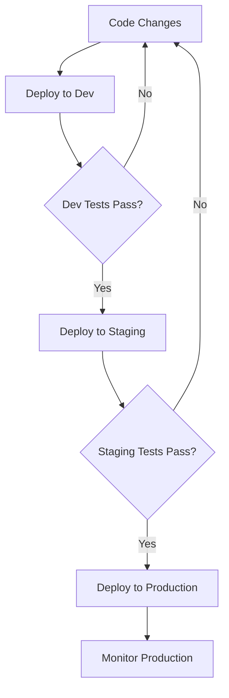

# 🚀 Deployment Reference Guide

## 🎯 **What This Guide Does**
Provides **comprehensive deployment strategies** and best practices for Azure Static Web Apps using centralized configuration management. Essential for production deployments, multi-environment workflows, and understanding deployment architecture.

## 🔧 **How It Does It**
- **Complete deployment process documentation** from infrastructure to content delivery
- **Multi-environment deployment strategies** with staging and production workflows
- **Infrastructure as Code guidance** using Bicep templates and Azure resources
- **Performance optimization techniques** for fast and reliable deployments
- **Security and monitoring integration** for production-ready applications

## 📚 **Related Documentation**
- **[📖 Documentation Hub](README.md)** - Overview of all documentation
- **[🚀 Quick Start](QUICK-START.md)** - Basic deployment for beginners
- **[📜 Scripts Reference](SCRIPTS-REFERENCE.md)** - Detailed script usage for deployments
- **[⚙️ Configuration System](CONFIGURATION-SYSTEM.md)** - Environment management for deployments

---

Comprehensive guide for deploying your resume website to Azure Static Web Apps using our centralized configuration system.

## 🏗️ Deployment Architecture

```
┌─────────────────┐    ┌──────────────────┐    ┌─────────────────┐
│   Source Code   │ => │  Build Process   │ => │ Azure Static WA │
│   (src/)        │    │  (optional)      │    │ (Production)    │
└─────────────────┘    └──────────────────┘    └─────────────────┘
         │                        │                        │
         │              ┌─────────────────┐                │
         └──────────────│ Configuration   │────────────────┘
                        │ (environments)  │
                        └─────────────────┘
```

## 🎯 Deployment Types

| Type | Script | Use Case | Duration | Infrastructure |
|------|--------|----------|----------|----------------|
| **Full Deployment** | `deploy-one-command.ps1` | Initial setup, infrastructure changes | 5-10 min | ✅ Creates/Updates |
| **Content Deployment** | `quick-deploy.ps1` | Regular updates, content changes | 2-5 min | ❌ Uses existing |
| **Validation Only** | `validate-deployment.ps1` | Health checks, testing | 30-60 sec | ❌ No changes |

## 🚀 Full Deployment Process

### deploy-one-command.ps1

**When to use:**
- First-time deployment
- Infrastructure changes
- Environment setup
- Resource group changes
- Major configuration updates

**Process Flow:**
```
1. 🔍 Validate Prerequisites
   ├── Azure CLI authentication
   ├── Configuration loading
   ├── Required tools check
   └── File structure validation

2. 🏗️ Infrastructure Provisioning
   ├── Create/update Resource Group
   ├── Deploy Bicep templates
   ├── Configure Static Web App
   └── Set up deployment tokens

3. 📦 Content Deployment
   ├── Build source files (if needed)
   ├── Package website content
   ├── Deploy to Static Web App
   └── Configure custom domain (if set)

4. ✅ Post-Deployment Validation
   ├── Verify website accessibility
   ├── Check SSL certificate
   ├── Validate content integrity
   └── Performance testing
```

**Usage:**
```powershell
# Basic deployment
.\scripts\deploy-one-command.ps1 -Environment "prod"

# Force deployment (skip warnings)
.\scripts\deploy-one-command.ps1 -Environment "prod" -Force

# Skip validation (for debugging)
.\scripts\deploy-one-command.ps1 -Environment "prod" -SkipValidation
```

**Sample Output:**
```
🚀 Starting deployment to environment: prod
📋 Loading configuration from config/environments.json
✅ Configuration validation passed
🔐 Azure authentication verified
🌐 Checking Azure connectivity...

🏗️ INFRASTRUCTURE PROVISIONING
✅ Resource Group 'jyothi-resume-RG' exists
✅ Bicep template validation passed
🔧 Deploying infrastructure changes...
✅ Static Web App 'jyothi-resume-WebApp' configured

📦 CONTENT DEPLOYMENT
📁 Source directory: src/
🔧 Building website content...
📤 Uploading to Azure Static Web Apps...
⏱️ Deployment progress: [████████████████████] 100%

✅ POST-DEPLOYMENT VALIDATION
🌐 Website accessibility: ✅ PASS (200 OK)
🔒 SSL certificate: ✅ VALID
📱 Responsive design: ✅ PASS
⚡ Performance check: ✅ GOOD (< 2s load time)

🎉 DEPLOYMENT SUCCESSFUL!
🌐 Live URL: https://jyothi-resume-WebApp.azurestaticapps.net
📊 Deployment ID: 12345abcdef
⏱️ Total time: 7 minutes 23 seconds
```

---

## ⚡ Quick Deployment Process

### quick-deploy.ps1

**When to use:**
- Regular content updates
- Bug fixes
- Resume content changes
- CSS/JS modifications
- Quick iterations

**Process Flow:**
```
1. ⚙️ Load Configuration
   ├── Environment settings
   ├── Azure resource names
   └── Deployment preferences

2. 🔍 Quick Validation
   ├── Azure authentication
   ├── Resource existence
   └── Source file checks

3. 📦 Content Build & Deploy
   ├── Build source files
   ├── Package for deployment
   ├── Deploy to existing Static Web App
   └── Monitor deployment status

4. ✅ Verify Deployment
   ├── Check HTTP status
   ├── Validate content updates
   └── Performance check
```

**Usage:**
```powershell
# Standard content deployment
.\scripts\quick-deploy.ps1 -Environment "prod"

# Deploy from custom source
.\scripts\quick-deploy.ps1 -Environment "prod" -Source "dist"

# Skip build process
.\scripts\quick-deploy.ps1 -Environment "prod" -SkipBuild

# Force without confirmation
.\scripts\quick-deploy.ps1 -Environment "prod" -Force
```

**Sample Output:**
```
⚡ Quick deployment to environment: prod
📋 Configuration loaded successfully
✅ Azure Static Web App 'jyothi-resume-WebApp' found
📁 Source directory: src/

🔧 BUILDING CONTENT
📦 Processing HTML files...
🎨 Optimizing CSS files...
⚙️ Minifying JavaScript...
✅ Build completed successfully

📤 DEPLOYING CONTENT
🚀 Uploading to Azure Static Web Apps...
⏱️ Upload progress: [████████████████████] 100%
✅ Deployment completed

🔍 VERIFICATION
🌐 Website status: ✅ 200 OK
📄 Content updated: ✅ VERIFIED
⚡ Load time: 1.2 seconds

✅ QUICK DEPLOYMENT SUCCESSFUL!
🌐 Live URL: https://jyothi-resume-WebApp.azurestaticapps.net
⏱️ Total time: 3 minutes 12 seconds
```

---

## 🌍 Multi-Environment Deployment

### Environment Strategy

**Production (prod)**
- **Purpose:** Live website for public access
- **Validation:** Comprehensive (all checks enabled)
- **Deployment:** Requires manual approval
- **Monitoring:** Full performance and availability monitoring

**Staging (staging)**
- **Purpose:** Pre-production testing and validation
- **Validation:** Standard (most checks enabled)
- **Deployment:** Automated after testing
- **Monitoring:** Basic health checks

**Development (dev)**
- **Purpose:** Development and feature testing
- **Validation:** Quick (essential checks only)
- **Deployment:** Automated on code changes
- **Monitoring:** Error tracking only

### Deployment Workflow



**Implementation:**
```powershell
# 1. Deploy to development
.\scripts\deploy-one-command.ps1 -Environment "dev"
.\scripts\validate-deployment.ps1 -Environment "dev"

# 2. If dev passes, deploy to staging
.\scripts\deploy-one-command.ps1 -Environment "staging"
.\scripts\validate-deployment.ps1 -Environment "staging" -IncludePerformance

# 3. If staging passes, deploy to production
.\scripts\deploy-one-command.ps1 -Environment "prod"
.\scripts\validate-deployment.ps1 -Environment "prod" -IncludePerformance
```

---

## 🔧 Infrastructure as Code

### Bicep Templates

**Main Template (`infra/main.bicep`):**
```bicep
targetScope = 'resourceGroup'

@description('Environment name')
param environmentName string = 'prod'

@description('Location for all resources')
param location string = resourceGroup().location

// Static Web App
module staticWebApp 'staticwebapp.bicep' = {
  name: 'staticWebApp'
  params: {
    name: 'jyothi-resume-WebApp'
    location: location
    sku: 'Free'
    environmentName: environmentName
  }
}

output staticWebAppUrl string = staticWebApp.outputs.defaultHostname
output deploymentToken string = staticWebApp.outputs.deploymentToken
```

**Resource Deployment:**
```powershell
# Deploy infrastructure only
az deployment group create \
  --resource-group "jyothi-resume-RG" \
  --template-file "infra/main.bicep" \
  --parameters environmentName="prod"

# Or use AZD for integrated deployment
azd up --environment prod
```

### Resource Naming Conventions

| Resource Type | Naming Pattern | Example |
|---------------|----------------|---------|
| Resource Group | `{project}-{env}-RG` | `jyothi-resume-prod-RG` |
| Static Web App | `{project}-{env}-WebApp` | `jyothi-resume-prod-WebApp` |
| Storage Account | `{project}{env}storage` | `jyothiprodstorge` |
| Key Vault | `{project}-{env}-kv` | `jyothi-resume-prod-kv` |

---

## 📊 Deployment Monitoring

### Built-in Monitoring

**Deployment Status Tracking:**
```powershell
# Get deployment status
$deploymentId = "12345abcdef"
az staticwebapp deployment show \
  --name "jyothi-resume-WebApp" \
  --deployment-id $deploymentId

# Monitor deployment logs
az staticwebapp logs show \
  --name "jyothi-resume-WebApp" \
  --environment-name "Production"
```

**Health Checks:**
```powershell
# Automated health monitoring
.\scripts\validate-deployment.ps1 -Environment "prod" -Continuous

# Performance monitoring
.\scripts\validate-deployment.ps1 -Environment "prod" -IncludePerformance
```

### Azure Monitor Integration

**Application Insights:**
```json
{
  "environments": {
    "prod": {
      "monitoring": {
        "applicationInsights": true,
        "performanceCounters": true,
        "customEvents": true
      }
    }
  }
}
```

**Metrics Tracked:**
- 📊 **Performance:** Page load times, resource loading
- 🔍 **Errors:** 404s, JavaScript errors, failed requests
- 👥 **Usage:** Page views, user sessions, geographic distribution
- 🌐 **Availability:** Uptime, response times, endpoint health

---

## 🔒 Security & Compliance

### Deployment Security

**Authentication:**
- 🔐 **Azure CLI:** Service principal or user authentication
- 🔑 **Deployment Tokens:** Automatically managed and rotated
- 🛡️ **RBAC:** Least privilege access principles

**Secure Configuration:**
```powershell
# Environment variables for sensitive data
$env:AZURE_SUBSCRIPTION_ID = "your-subscription-id"
$env:DEPLOYMENT_TOKEN = "your-deployment-token"

# Never commit secrets to repository
echo "config/.env" >> .gitignore
```

### SSL/TLS Configuration

**Automatic HTTPS:**
- ✅ **SSL Certificate:** Automatically provisioned by Azure
- ✅ **HTTPS Redirect:** Enforced for all traffic
- ✅ **Security Headers:** HSTS, CSP, X-Frame-Options

**Custom Domain Setup:**
```powershell
# Configure custom domain
az staticwebapp hostname set \
  --name "jyothi-resume-WebApp" \
  --hostname "resume.yourdomain.com"
```

---

## 📈 Performance Optimization

### Build Optimization

**HTML Minification:**
```json
{
  "build": {
    "optimization": {
      "minifyHtml": true,
      "minifyCss": true,
      "minifyJs": true,
      "optimizeImages": true
    }
  }
}
```

**Caching Strategy:**
```json
{
  "staticwebapp.config.json": {
    "globalHeaders": {
      "Cache-Control": "public, max-age=31536000, immutable"
    },
    "routes": [
      {
        "route": "*.html",
        "headers": {
          "Cache-Control": "public, max-age=3600"
        }
      }
    ]
  }
}
```

### CDN Integration

**Azure CDN Configuration:**
```powershell
# Enable Azure CDN
az cdn profile create \
  --name "jyothi-resume-cdn" \
  --resource-group "jyothi-resume-RG" \
  --sku "Standard_Microsoft"

az cdn endpoint create \
  --name "jyothi-resume-endpoint" \
  --profile-name "jyothi-resume-cdn" \
  --resource-group "jyothi-resume-RG" \
  --origin "jyothi-resume-WebApp.azurestaticapps.net"
```

---

## 🚨 Troubleshooting Deployments

### Common Issues

#### Issue: "Authentication failed"
```powershell
# Solution: Re-authenticate
az login
azd auth login

# Verify authentication
az account show
```

#### Issue: "Resource group not found"
```powershell
# Solution: Create resource group
az group create \
  --name "jyothi-resume-RG" \
  --location "eastasia"
```

#### Issue: "Static Web App deployment failed"
```powershell
# Solution: Check deployment logs
az staticwebapp logs show \
  --name "jyothi-resume-WebApp"

# Retry deployment
.\scripts\quick-deploy.ps1 -Environment "prod" -Force
```

#### Issue: "Website not accessible"
```powershell
# Solution: Validate deployment
.\scripts\validate-deployment.ps1 -Environment "prod"

# Check DNS propagation
nslookup jyothi-resume-WebApp.azurestaticapps.net
```

### Deployment Logs

**Enable Verbose Logging:**
```powershell
# Enable detailed logging
$VerbosePreference = "Continue"
$DebugPreference = "Continue"

.\scripts\deploy-one-command.ps1 -Environment "prod" -Verbose -Debug
```

**Log Analysis:**
```powershell
# Save deployment logs
.\scripts\deploy-one-command.ps1 -Environment "prod" | 
  Tee-Object -FilePath "logs/deployment-$(Get-Date -Format 'yyyyMMdd-HHmmss').log"

# Search for errors
Select-String -Path "logs/*.log" -Pattern "ERROR|FAILED|Exception"
```

---

## 📚 Best Practices

### 1. Deployment Workflow
- ✅ **Test First:** Always deploy to dev/staging before production
- ✅ **Validate:** Run validation scripts before and after deployment
- ✅ **Monitor:** Watch deployment logs and health metrics
- ✅ **Backup:** Keep previous version accessible for rollback

### 2. Configuration Management
- ⚙️ **Environment Separation:** Use separate environments for dev/staging/prod
- ⚙️ **Configuration Validation:** Validate settings before deployment
- ⚙️ **Secret Management:** Keep sensitive data in environment variables
- ⚙️ **Version Control:** Track configuration changes in git

### 3. Performance
- ⚡ **Quick Deployments:** Use `quick-deploy.ps1` for content-only changes
- ⚡ **Build Optimization:** Minify and compress assets
- ⚡ **CDN Usage:** Leverage Azure CDN for global performance
- ⚡ **Monitoring:** Track performance metrics continuously

### 4. Security
- 🔒 **Authentication:** Regularly rotate deployment tokens
- 🔒 **HTTPS Only:** Enforce SSL/TLS for all traffic
- 🔒 **Access Control:** Use least privilege principles
- 🔒 **Security Headers:** Implement comprehensive security headers

---

**Next Steps:**
- 📖 [Quick Start Guide](QUICK-START.md)
- ⚙️ [Configuration System](CONFIGURATION-SYSTEM.md)
- 📜 [Scripts Reference](SCRIPTS-REFERENCE.md)
- 🔧 [Troubleshooting Guide](TROUBLESHOOTING.md)
