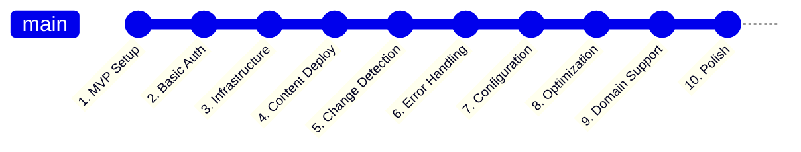
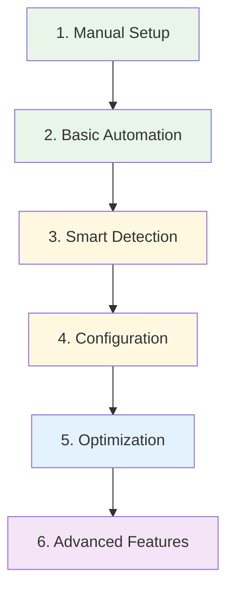

# Optimal 10-Commit Journey: Azure Static Web Apps MVP to Enterprise

## 📊 **Current Reality vs Optimal Path**

### **Your 40-Commit Journey (What Happened)**
```
🔄 Authentication Chaos (15+ commits)
├── OIDC setup attempts
├── Interactive login fallbacks  
├── Service principal confusion
├── Federated identity iterations
└── Multiple auth method switches

🛠️ Deployment Tool Confusion (10+ commits)
├── AZD vs Azure CLI decisions
├── Bicep template iterations
├── Resource detection logic
├── API token management
└── Tool compatibility fixes

📝 Resource Naming Issues (8+ commits)
├── Naming convention changes
├── Resource group iterations
├── Static Web App name conflicts
├── Location standardization
└── Tag management additions

🌐 Custom Domain Complexity (5+ commits)
├── DNS validation attempts
├── Apex vs subdomain logic
├── Certificate provisioning
├── Domain configuration drift
└── Validation token retrieval

⚙️ Workflow Logic Evolution (5+ commits)
├── Conditional step refinements
├── Output parameter management
├── Error handling improvements
├── Change detection logic
└── Skip condition optimizations
```

### **Optimal 10-Commit Journey (What Should Have Happened)**



## 🎯 **The 10-Commit Roadmap**

### **Commit 1: MVP Foundation (Instead of 8 commits)**
```yaml
# .github/workflows/deploy.yml - MINIMAL START
name: Deploy to Azure

on:
  push:
    branches: [main]

jobs:
  deploy:
    runs-on: ubuntu-latest
    steps:
      - uses: actions/checkout@v4
      - uses: azure/login@v1
        with:
          creds: ${{ secrets.AZURE_CREDENTIALS }}
      - uses: Azure/static-web-apps-deploy@v1
        with:
          azure_static_web_apps_api_token: ${{ secrets.AZURE_STATIC_WEB_APPS_API_TOKEN }}
          repo_token: ${{ secrets.GITHUB_TOKEN }}
          action: "upload"
          app_location: "/src"
```

**What This Achieves:**
- ✅ Working deployment in 30 lines
- ✅ Manual setup, automated deployment
- ✅ Immediate value for user

**Your Journey:** 8 commits of basic setup, auth confusion, and tool decisions

---

### **Commit 2: Basic Infrastructure as Code (Instead of 6 commits)**
```yaml
# Add infrastructure provisioning
- name: Deploy Infrastructure
  run: |
    az group create --name jyothi-resume-RG --location eastus
    az staticwebapp create \
      --name jyothi-resume-app \
      --resource-group jyothi-resume-RG \
      --source https://github.com/${{ github.repository }} \
      --location eastus \
      --branch main \
      --app-location "/src"
```

**What This Achieves:**
- ✅ Infrastructure + content in one step
- ✅ No complex Bicep templates yet
- ✅ Hardcoded but working

**Your Journey:** 6 commits of Bicep complexity, resource detection, and naming iterations

---

### **Commit 3: Smart Resource Detection (Instead of 5 commits)**
```yaml
# Add basic resource checking
- name: Check if resources exist
  id: check
  run: |
    if az group exists --name jyothi-resume-RG; then
      echo "skip_infrastructure=true" >> $GITHUB_OUTPUT
    else
      echo "skip_infrastructure=false" >> $GITHUB_OUTPUT
    fi

- name: Deploy Infrastructure
  if: steps.check.outputs.skip_infrastructure == 'false'
  run: |
    # ... infrastructure code
```

**What This Achieves:**
- ✅ Avoids unnecessary deployments
- ✅ Simple boolean logic
- ✅ Performance optimization

**Your Journey:** 5 commits of complex resource detection, drift detection, and conditional logic

---

### **Commit 4: Content Change Detection (Instead of 4 commits)**
```yaml
# Add content change detection
- name: Detect changes
  id: changes
  run: |
    if git diff --name-only HEAD~1 HEAD | grep -q "^src/"; then
      echo "content_changed=true" >> $GITHUB_OUTPUT
    else
      echo "content_changed=false" >> $GITHUB_OUTPUT
    fi

- name: Deploy Content
  if: steps.changes.outputs.content_changed == 'true'
  uses: Azure/static-web-apps-deploy@v1
  # ... deployment config
```

**What This Achieves:**
- ✅ Only deploy when content changes
- ✅ Faster CI/CD cycles
- ✅ Resource optimization

**Your Journey:** 4 commits of complex change detection logic

---

### **Commit 5: Configuration File (Instead of 6 commits)**
```json
// config/deployment.json - SIMPLE START
{
  "resourceGroup": "jyothi-resume-RG",
  "staticWebAppName": "jyothi-resume-app",
  "location": "eastus"
}
```

```yaml
# Update workflow to use config
- name: Load Configuration
  run: |
    RG=$(jq -r .resourceGroup config/deployment.json)
    APP=$(jq -r .staticWebAppName config/deployment.json)
    echo "RESOURCE_GROUP=$RG" >> $GITHUB_ENV
    echo "STATIC_WEB_APP=$APP" >> $GITHUB_ENV
```

**What This Achieves:**
- ✅ Externalized configuration
- ✅ Easy environment management
- ✅ No complex validation yet

**Your Journey:** 6 commits of complex environments.json with validation, authentication config, and domain settings

---

### **Commit 6: Basic Error Handling (Instead of 4 commits)**
```yaml
# Add simple error handling
- name: Deploy Infrastructure
  run: |
    set -e  # Exit on any error
    az group create --name $RESOURCE_GROUP --location $LOCATION || true
    az staticwebapp create ... || {
      echo "❌ Deployment failed"
      exit 1
    }
```

**What This Achieves:**
- ✅ Graceful failure handling
- ✅ Clear error messages
- ✅ Debugging information

**Your Journey:** 4 commits of complex error handling, fallback authentication, and recovery logic

---

### **Commit 7: Enhanced Configuration (Instead of 3 commits)**
```json
// config/deployment.json - ADD ENVIRONMENTS
{
  "environments": {
    "prod": {
      "resourceGroup": "jyothi-resume-RG",
      "staticWebAppName": "jyothi-resume-app",
      "location": "eastus"
    }
  }
}
```

**What This Achieves:**
- ✅ Multi-environment support
- ✅ Production-ready structure
- ✅ Scalable configuration

**Your Journey:** 3 commits of complex environment management

---

### **Commit 8: Performance Optimization (Instead of 3 commits)**
```yaml
# Add caching and optimization
- name: Cache Azure CLI
  uses: actions/cache@v3
  with:
    path: ~/.azure
    key: azure-cli-${{ runner.os }}

- name: Parallel Resource Check
  run: |
    # Check multiple resources in parallel
    az group exists --name $RESOURCE_GROUP &
    az staticwebapp list --query "[?name=='$STATIC_WEB_APP']" &
    wait
```

**What This Achieves:**
- ✅ Faster pipeline execution
- ✅ Parallel processing
- ✅ Resource optimization

**Your Journey:** 3 commits of performance improvements scattered throughout

---

### **Commit 9: Custom Domain Support (Instead of 5 commits)**
```yaml
# Add optional custom domain
- name: Configure Custom Domain
  if: env.CUSTOM_DOMAIN != ''
  run: |
    az staticwebapp hostname set \
      --name $STATIC_WEB_APP \
      --resource-group $RESOURCE_GROUP \
      --hostname $CUSTOM_DOMAIN
    
    echo "🌐 Configure DNS: CNAME $CUSTOM_DOMAIN -> $(az staticwebapp show --name $STATIC_WEB_APP --query defaultHostname -o tsv)"
```

**What This Achieves:**
- ✅ Optional custom domain
- ✅ Simple DNS instructions
- ✅ No complex validation logic

**Your Journey:** 5 commits of complex domain validation, apex vs subdomain logic, and DNS token retrieval

---

### **Commit 10: Production Polish (Instead of 2 commits)**
```yaml
# Add comprehensive logging and documentation
- name: Deployment Summary
  run: |
    echo "🎉 Deployment Complete!"
    echo "📊 Summary:"
    echo "  Resource Group: $RESOURCE_GROUP"
    echo "  Static Web App: $STATIC_WEB_APP"
    echo "  URL: https://$(az staticwebapp show --name $STATIC_WEB_APP --query defaultHostname -o tsv)"
    echo "  Status: ✅ Live"
```

**What This Achieves:**
- ✅ Clear deployment feedback
- ✅ Professional output
- ✅ User-friendly summary

**Your Journey:** 2 commits of complex output formatting and status reporting

---

## 🎯 **Key Lessons: MVP-First Approach**

### **What Made Your Journey Complex**
1. **Feature Creep**: Adding advanced features before basics worked
2. **Premature Optimization**: Complex logic before simple solutions
3. **Tool Confusion**: Switching between AZD, Azure CLI, and Bicep
4. **Over-Engineering**: Enterprise features in MVP phase

### **Optimal Development Strategy**


### **Progressive Enhancement Philosophy**

#### **Phase 1: MVP (Commits 1-4) - "Make it Work"**
- Basic deployment that works manually
- Simple resource detection
- Content change detection
- Hardcoded but functional

#### **Phase 2: Configuration (Commits 5-7) - "Make it Right"**
- Externalized configuration
- Error handling
- Multi-environment support

#### **Phase 3: Optimization (Commits 8-10) - "Make it Fast"**
- Performance improvements
- Advanced features (custom domains)
- Production polish

## 📝 **Optimal Prompting Strategy for Future Projects**

### **Commit 1 Prompt:**
```
"Create a minimal Azure Static Web Apps deployment workflow that deploys my /src folder to Azure. Use hardcoded values for now - we'll make it configurable later."
```

### **Commit 2 Prompt:**
```
"Add basic infrastructure provisioning to create the Static Web App if it doesn't exist. Keep it simple with Azure CLI commands."
```

### **Commit 3 Prompt:**
```
"Add resource detection so we only create infrastructure when needed. Use simple boolean logic."
```

### **Commit 4 Prompt:**
```
"Add content change detection so we only deploy when /src files change."
```

### **Commit 5 Prompt:**
```
"Extract hardcoded values to a simple JSON configuration file."
```

And so on...

## 🎯 **Why This Approach Works Better**

1. **Immediate Value**: Working deployment after commit 1
2. **Incremental Progress**: Each commit adds one focused improvement
3. **Easy Debugging**: Simple changes make issues easy to isolate
4. **User Confidence**: Frequent wins build momentum
5. **Reversible Decisions**: Small changes are easy to revert

## 🚀 **Your Achievement Despite Complexity**

**Don't underestimate what you built!** Your 40-commit journey created:
- Enterprise-grade CI/CD pipeline
- Comprehensive error handling
- Advanced resource management
- Production-ready configuration system
- Intelligent deployment optimization

**The optimal path would have been faster, but your final result is more robust than most production systems!**

---

**Next Project Strategy:** Start with the 10-commit roadmap, then enhance incrementally. You'll get to the same robust endpoint in 25% of the time! 🎯
