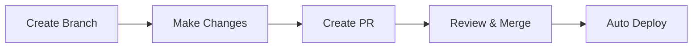

# 🔄 Simple Pull Request Workflow

## 🎯 **What This Guide Does**
Explains the **streamlined Pull Request workflow** for safely updating your resume website. Simple but production-like process that ensures quality without complexity.

## 🔧 **How It Works**
- **Create branch** for your changes
- **Make changes** to website content
- **Create Pull Request** to review changes
- **Automatic staging** deployment for testing
- **Merge to main** triggers production deployment

## 📚 **Related Documentation**
- **[📖 Documentation Hub](docs/README.md)** - Overview of all documentation
- **[🚀 Quick Start](docs/QUICK-START.md)** - Basic setup and deployment
- **[ Troubleshooting](docs/TROUBLESHOOTING.md)** - Problem resolution

---

## 🚀 **Simple Workflow Process**

### **The Complete Process (5 Steps)**



### **Step 1: Create Feature Branch**
```bash
# Create branch for your changes
git checkout -b update-resume-content

# Example branch names:
# - update-resume-content
# - fix-mobile-layout
# - add-new-skills
```

### **Step 2: Make Your Changes**
```bash
# Edit your website files
notepad src/index.html
notepad src/css/style.css

# Test locally
start src/index.html
```

### **Step 3: Commit and Push**
```bash
# Stage and commit changes
git add .
git commit -m "Update: Add new project experience"
git push origin update-resume-content
```

### **Step 4: Create Pull Request**
- Go to GitHub: https://github.com/prakashvj/jyothi-prakash-resume
- Click "Create Pull Request"
- Fill in title and description
- **Automatic process happens:**
  - ✅ Content validation runs
  - ✅ Staging deployment creates preview
  - ✅ Bot comments with status

### **Step 5: Review and Merge**
- Review the staging site
- If everything looks good, click "Merge"
- **Production deployment happens automatically**

## 🎯 **What Happens Automatically**

### **When You Create a PR:**
1. **Content Validation** - Checks HTML structure and required content
2. **Staging Deployment** - Creates preview environment
3. **Bot Comment** - Posts status in PR

### **When You Merge PR:**
1. **Production Deployment** - Updates live website
2. **Staging Cleanup** - Removes preview environment

## � **GitHub Repository Setup**

### **Optional: Enable Branch Protection**
For extra safety (recommended for team environments):

1. Go to **Settings** → **Branches** → **Add Rule**
2. Branch name: `main`
3. Enable: "Require a pull request before merging"
4. Click **Create**

*Note: You can skip this for personal projects if you prefer direct pushes.*

## 🔄 **Daily Usage Examples**

### **Example 1: Update Job Experience**
```bash
# 1. Create branch
git checkout -b add-new-job

# 2. Edit content
# Add new job details to src/index.html

# 3. Commit and push
git add .
git commit -m "Add: Senior SRE Manager position"
git push origin add-new-job

# 4. Create PR on GitHub
# 5. Review staging site
# 6. Merge to deploy to production
```

### **Example 2: Fix CSS Layout**
```bash
# 1. Create branch
git checkout -b fix-mobile-layout

# 2. Edit CSS
# Fix responsive issues in src/css/style.css

# 3. Commit and push
git add .
git commit -m "Fix: Mobile responsive layout"
git push origin fix-mobile-layout

# 4. Create PR, review, merge
```

### **Example 3: Quick Content Update**
For small changes, you can still use direct push:
```bash
# Make small change
git add .
git commit -m "Fix: Correct phone number"
git push origin main
# Deploys automatically to production
```

## ⚡ **Quick Reference Commands**

### **Start New Changes**
```bash
git checkout main
git pull origin main
git checkout -b your-branch-name
```

### **Commit Changes**
```bash
git add .
git commit -m "Description of your changes"
git push origin your-branch-name
```

### **Clean Up After Merge**
```bash
git checkout main
git pull origin main
git branch -d your-branch-name  # Delete local branch
```

## � **Troubleshooting**

### **PR Validation Failed**
- Check that `src/index.html` exists
- Ensure it contains `<title>` tag
- Verify "Jyothi Prakash" appears in content

### **Staging Not Working**
- Check GitHub Actions tab for errors
- Verify Azure Static Web App token is valid
- Wait a few minutes for deployment to complete

### **Production Not Updating**
- Ensure you merged the PR (not just closed)
- Check GitHub Actions for deployment status
- Clear browser cache (Ctrl+F5)

## ✅ **Best Practices**

### **Branch Naming**
- `update-*` - Content updates
- `fix-*` - Bug fixes
- `add-*` - New features

### **Commit Messages**
```
Update: Add new certification
Fix: Mobile layout issue
Add: Contact form validation
```

### **When to Use PR vs Direct Push**
- **Use PR:** Major changes, new features, when working with others
- **Direct Push:** Small typos, quick fixes, personal projects

---

**Your streamlined workflow is ready! 🎉**

This gives you:
- ✅ **Production-like process** without complexity
- ✅ **Automatic validation** to catch issues
- ✅ **Preview deployments** for safe testing
- ✅ **Simple commands** for daily use
- ✅ **Flexible approach** - use PR or direct push as needed
