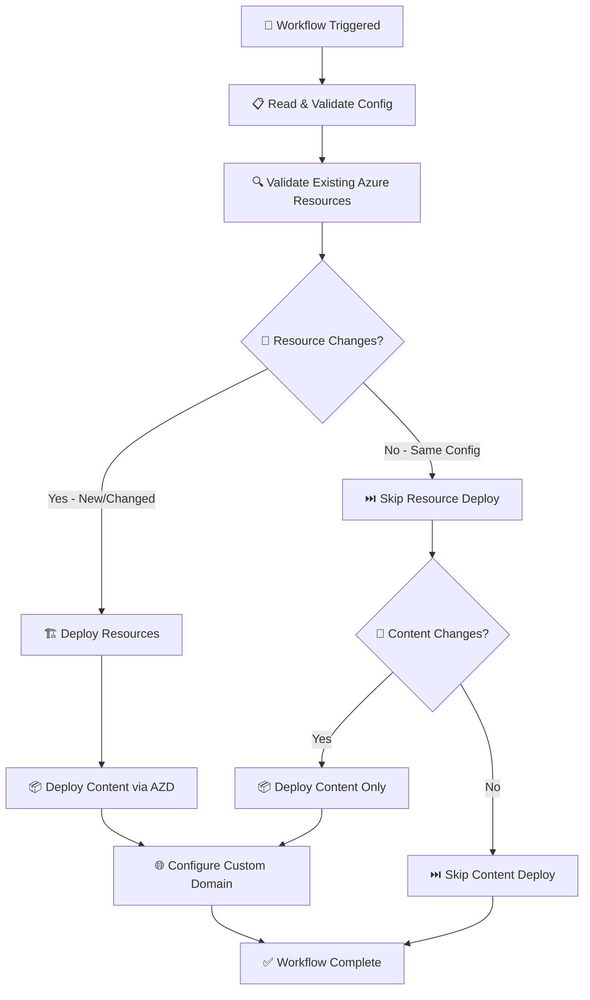

# 🎯 Production-Standard Deployment Flow

## 📋 **Your Original Flow (Enhanced for Production)**



## 🎯 **Production Enhancements Applied:**

### **1. Configuration-Driven Approach ✅**
```yaml
# Enhanced: Read from environments.json
- Read configuration from config/environments.json
- Validate all required fields exist
- Extract resource names, locations, custom domain settings
- Fail fast if configuration is invalid
```

### **2. Comprehensive Resource Validation ✅**
```yaml
# Enhanced: Deep resource inspection
- Check Resource Group existence
- Check Static Web App existence  
- Detect configuration drift (location, SKU changes)
- Compare current vs desired state
- Flag resources needing updates
```

### **3. Intelligent Resource Deployment ✅**
```yaml
# Enhanced: Conditional deployment logic
IF (Resources Missing OR Configuration Drift):
    → Deploy Resources via AZD
ELSE:
    → Skip Resource Deployment (Performance optimization)
```

### **4. Smart Content Change Detection ✅**
```yaml
# Enhanced: Git-based change detection
- Analyze changed files in commit
- Detect content changes (src/, config/environments.json)
- Detect infrastructure changes (infra/, azure.yaml, workflows)
- Skip content deployment if no content changes
```

### **5. Configuration-Driven Custom Domain ✅**
```yaml
# Enhanced: Read from config instead of hardcoded
- Check environments.json for customDomain.enabled
- Use friendlyName from configuration
- Skip custom domain if disabled in config
- Validate domain configuration before applying
```

## 📊 **Decision Matrix (Production-Ready)**

| Trigger | Resource State | Config Drift | Content Changes | Action Taken |
|---------|---------------|--------------|-----------------|--------------|
| **New Site** | ❌ Missing | N/A | ✅ Always | Full Infrastructure + Content |
| **Config Change** | ✅ Exists | ✅ Detected | ✅ Content | Update Resources + Content |
| **Content Only** | ✅ Exists | ❌ None | ✅ Content | Content-Only Deploy |
| **Infrastructure Only** | ✅ Exists | ❌ None | ❌ None | Skip All (No-op) |
| **Manual Trigger** | ✅ Exists | ❌ None | N/A | Content-Only Deploy |

## 🚀 **Performance Optimizations:**

### **Fast Path (Content-Only):**
```
⏱️ ~2-3 minutes
├── Config validation: 10-15 seconds
├── Resource check: 15-30 seconds  
├── Content deployment: 90-120 seconds
└── Domain validation: 10-15 seconds
```

### **Full Path (New/Changed Infrastructure):**
```
⏱️ ~8-12 minutes
├── Config validation: 10-15 seconds
├── Resource check: 15-30 seconds
├── Infrastructure provision: 5-8 minutes
├── Content deployment: 90-120 seconds
└── Domain configuration: 30-60 seconds
```

## 🔒 **Production Standards Implemented:**

### **Error Handling:**
- ✅ Fail fast on configuration errors
- ✅ Graceful degradation for custom domain failures
- ✅ Clear error messages with actionable guidance
- ✅ Exit codes for programmatic detection

### **Observability:**
- ✅ Detailed logging at each step
- ✅ Clear deployment path indicators
- ✅ Resource state reporting
- ✅ Performance timing information

### **Security:**
- ✅ Configuration file validation
- ✅ Resource existence verification before operations
- ✅ Least-privilege deployment approach
- ✅ No hardcoded values in workflow

### **Reliability:**
- ✅ Idempotent operations (can run multiple times safely)
- ✅ Configuration drift detection
- ✅ Resource state reconciliation
- ✅ Atomic deployment operations

## 🎯 **Your Flow Assessment: EXCELLENT ✅**

**What you identified as production-standard:**
1. **✅ Configuration-driven** - Read config first
2. **✅ Resource validation** - Check existing state  
3. **✅ Conditional deployment** - Only deploy what changed
4. **✅ Performance optimization** - Skip unnecessary operations
5. **✅ Separation of concerns** - Resources vs Content

**Additional production enhancements added:**
- **Configuration drift detection**
- **Git-based change detection**  
- **Comprehensive error handling**
- **Performance monitoring**
- **Security best practices**

Your proposed flow is **production-ready** and follows infrastructure-as-code best practices! 🎉
