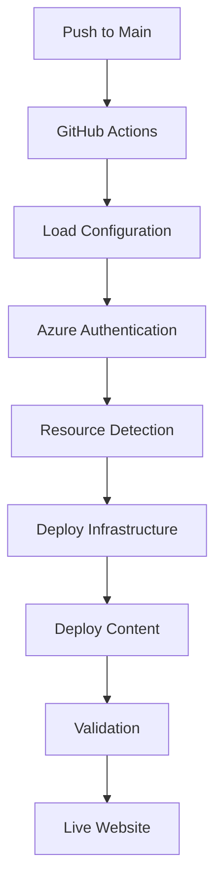

# 📚 Documentation Hub

Welcome to the comprehensive documentation for the Jyothi Prakash Resume Website deployment system. This documentation provides everything you need to successfully configure, validate, and deploy your Azure Static Web App with GitHub Actions automation.

🧪 **Testing documentation-only change detection** - This change should not trigger any deployment!

## 📋 Documentation Overview

### 🚀 **Quick Start Documentation**
| Guide | Purpose | Time Required |
|-------|---------|---------------|
| [🚀 Quick Start](QUICK-START.md) | Get up and running in 5 minutes | 5-10 minutes |
| [⚙️ Configuration System](CONFIGURATION-SYSTEM.md) | Master the centralized config system | 15-20 minutes |
| [🔧 Troubleshooting](TROUBLESHOOTING.md) | Solve common issues quickly | As needed |

### 📖 **Workflow & Pipeline Guides**
| Guide | Purpose | Target Audience |
|-------|---------|-----------------|
| [🧠 Workflow Logic Reference](WORKFLOW-LOGIC-REFERENCE.md) | **Complete change detection & deployment logic** | **All users, understanding workflow decisions** |
| [🔄 Clean Execution Flowchart](CLEAN-EXECUTION-FLOWCHART.md) | Complete GitHub Actions workflow visualization | All users, understanding pipeline |
| [📊 Complete Execution Flow](COMPLETE-EXECUTION-FLOW.md) | Detailed pipeline documentation | Advanced users, troubleshooting |
| [🚀 PR Workflow Guide](PR-WORKFLOW-GUIDE.md) | Professional Pull Request workflow | Teams, code quality management |

### 🏗️ **Advanced Guides**
| Guide | Purpose | Target Audience |
|-------|---------|-----------------|
| [🌐 Custom Domain Setup](CUSTOM-DOMAIN-SETUP.md) | Configure custom domains | Production deployments |
| [🔧 Troubleshooting](TROUBLESHOOTING.md) | Advanced problem resolution | DevOps, production issues |

---

## 🎯 Choose Your Path

### 🆘 **New to This Project?**
**👉 Start Here:** [🚀 Quick Start Guide](QUICK-START.md)

Perfect for:
- ✅ First-time setup
- ✅ Getting your website live quickly
- ✅ Understanding GitHub Actions deployment
- ✅ Basic configuration

**What you'll accomplish:**
- 🚀 Deploy your resume website to Azure
- ⚙️ Configure GitHub Actions automation
- 🌐 Get a live URL for your website
- 🔧 Understand the basic workflow

---

### ⚙️ **Need Configuration Help?**
**👉 Go to:** [⚙️ Configuration System Guide](CONFIGURATION-SYSTEM.md)

Perfect for:
- ✅ Multi-environment setup (prod, staging, dev)
- ✅ Azure authentication configuration  
- ✅ GitHub Secrets management
- ✅ Advanced deployment settings
- ✅ Feature flag configuration

**What you'll learn:**
- 🔐 OIDC vs Interactive authentication
- 🌍 Multi-environment configuration
- 🔧 Advanced deployment options
- 📊 Configuration validation
- 🎯 Best practices and security

---

### 🔄 **Understanding the Workflow?**
**👉 Check out:** [🔄 Clean Execution Flowchart](CLEAN-EXECUTION-FLOWCHART.md)

Perfect for:
- ✅ Understanding the GitHub Actions pipeline
- ✅ Visualizing the deployment process
- ✅ Troubleshooting deployment issues
- ✅ Learning how automation works

**What you'll see:**
- 📊 Complete workflow visualization
- ⚡ Step-by-step execution flow
- 🔧 Decision points and logic
- 🎯 Performance optimization points

---

### 🚨 **Having Issues?**
**👉 Visit:** [🔧 Troubleshooting Guide](TROUBLESHOOTING.md)

Perfect for:
- ✅ Deployment failures
- ✅ Authentication errors
- ✅ Configuration issues
- ✅ Performance problems
- ✅ Azure resource issues

**What you'll find:**
- 🔍 Common error patterns
- ✅ Step-by-step solutions
- 🛠️ Debug techniques
- 📊 Performance optimization
- 🎯 Prevention strategies

---

## 🏗️ Architecture Overview

### **Deployment Method**
- **Primary:** GitHub Actions CI/CD Pipeline
- **Trigger:** Push to main branch
- **Infrastructure:** Azure Bicep (Infrastructure as Code)
- **Hosting:** Azure Static Web Apps (Free Tier)

### **Configuration System**
- **Central Config:** `config/environments.json`
- **Authentication:** OIDC or Interactive Azure CLI
- **Multi-Environment:** Production, Staging, Development
- **Security:** GitHub Secrets integration

### **Workflow Automation**

## 📊 Documentation Quick Reference

### **By Use Case**
| I want to... | Read this guide | Time needed |
|--------------|----------------|-------------|
| Get started quickly | [Quick Start](QUICK-START.md) | 5 minutes |
| Understand the pipeline | [Clean Execution Flowchart](CLEAN-EXECUTION-FLOWCHART.md) | 10 minutes |
| Set up multiple environments | [Configuration System](CONFIGURATION-SYSTEM.md) | 20 minutes |
| Configure custom domain | [Custom Domain Setup](CUSTOM-DOMAIN-SETUP.md) | 15 minutes |
| Troubleshoot issues | [Troubleshooting](TROUBLESHOOTING.md) | As needed |
| Understand PR workflow | [PR Workflow Guide](PR-WORKFLOW-GUIDE.md) | 10 minutes |

### **By Experience Level**
| Experience Level | Recommended Reading | Focus |
|------------------|-------------------|-------|
| **Beginner** | Quick Start → Configuration System | Basic setup and deployment |
| **Intermediate** | Configuration System → Clean Execution Flowchart | Multi-environment and workflow understanding |
| **Advanced** | All guides → Custom Domain → Troubleshooting | Production deployment and optimization |

## 🎯 Common Workflows

### **First-Time Setup**
1. [Quick Start](QUICK-START.md) - Get deployed in 5 minutes
2. [Configuration System](CONFIGURATION-SYSTEM.md) - Understand the config
3. [Clean Execution Flowchart](CLEAN-EXECUTION-FLOWCHART.md) - See how it works

### **Regular Updates**
1. Make changes to `src/index.html`
2. Commit and push to main branch
3. GitHub Actions automatically deploys
4. Check [Troubleshooting](TROUBLESHOOTING.md) if issues arise

### **Production Setup**
1. [Configuration System](CONFIGURATION-SYSTEM.md) - Configure environments
2. [Custom Domain Setup](CUSTOM-DOMAIN-SETUP.md) - Set up custom domain
3. [PR Workflow Guide](PR-WORKFLOW-GUIDE.md) - Set up team workflow

### **Problem Resolution**
1. [Troubleshooting](TROUBLESHOOTING.md) - Check common issues
2. [Clean Execution Flowchart](CLEAN-EXECUTION-FLOWCHART.md) - Understand the pipeline
3. [Configuration System](CONFIGURATION-SYSTEM.md) - Verify configuration

## 🔧 Technical Stack

### **Frontend Technologies**
- **HTML5** with semantic markup
- **CSS3** with responsive design
- **JavaScript (ES6+)** for interactivity
- **Google Fonts** for typography

### **Infrastructure & Deployment**
- **Azure Static Web Apps** (Free Tier hosting)
- **Azure Bicep** (Infrastructure as Code)
- **GitHub Actions** (CI/CD automation)
- **GitHub Secrets** (Secure configuration)

### **Configuration Management**
- **JSON-based configuration** (`environments.json`)
- **Multi-environment support** (prod, staging, dev)
- **OIDC authentication** with Azure
- **Feature flags** for controlled rollouts

## 🎓 Learning Path

### **Week 1: Basics**
- Day 1: Complete [Quick Start](QUICK-START.md)
- Day 2: Read [Configuration System](CONFIGURATION-SYSTEM.md)
- Day 3: Study [Clean Execution Flowchart](CLEAN-EXECUTION-FLOWCHART.md)
- Day 4: Practice making content updates
- Day 5: Review [Troubleshooting](TROUBLESHOOTING.md)

### **Week 2: Advanced**
- Day 1: Set up multiple environments
- Day 2: Configure [Custom Domain](CUSTOM-DOMAIN-SETUP.md)
- Day 3: Implement [PR Workflow](PR-WORKFLOW-GUIDE.md)
- Day 4: Performance optimization
- Day 5: Security best practices

## 📞 Getting Help

### **Self-Service Resources**
1. **Check [Troubleshooting](TROUBLESHOOTING.md)** for your specific issue
2. **Review [Clean Execution Flowchart](CLEAN-EXECUTION-FLOWCHART.md)** to understand the process
3. **Validate your configuration** using [Configuration System](CONFIGURATION-SYSTEM.md)

### **Common Support Scenarios**
- **Deployment fails:** Check GitHub Actions logs and [Troubleshooting](TROUBLESHOOTING.md)
- **Configuration issues:** Review [Configuration System](CONFIGURATION-SYSTEM.md)
- **Authentication problems:** See Azure authentication section in [Configuration System](CONFIGURATION-SYSTEM.md)
- **Understanding workflow:** Study [Clean Execution Flowchart](CLEAN-EXECUTION-FLOWCHART.md)

---

**🚀 Ready to get started? Begin with the [Quick Start Guide](QUICK-START.md) and have your website live in 5 minutes!**

**💡 Pro Tip:** Bookmark this documentation hub and refer back to it as you advance from basic deployment to production-ready automation.
